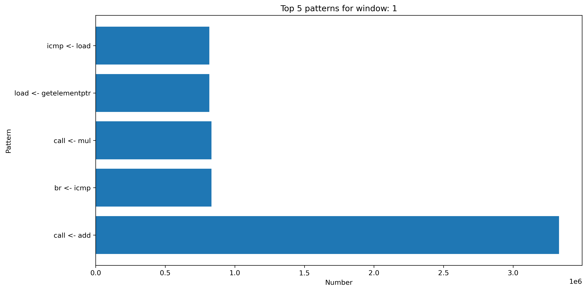
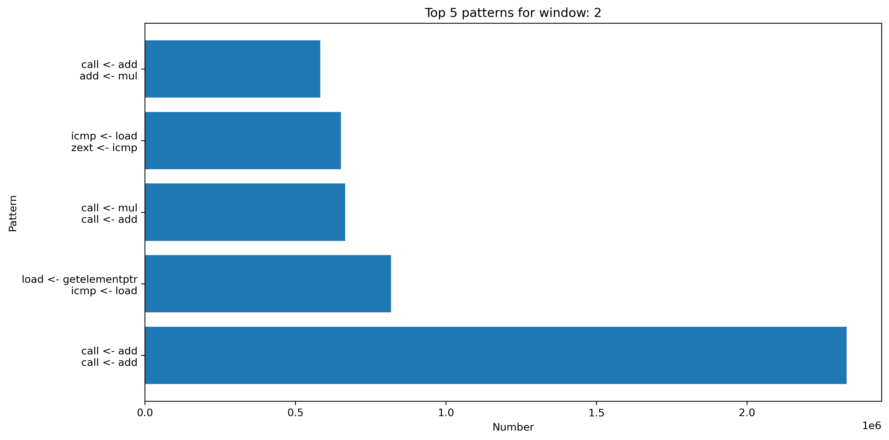
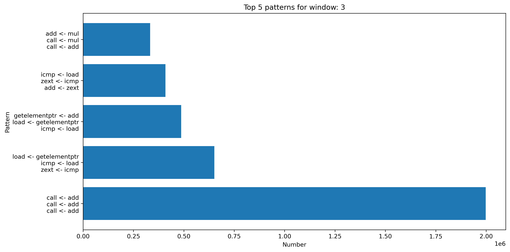
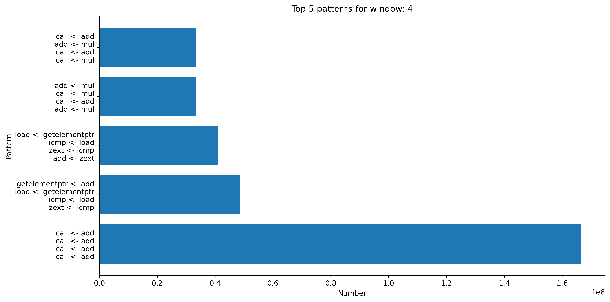

# LLVM Pass example
This is example of LLVM pass that collect static information about app IR and insert instrumentation for collecting dynamic information.


## Usage:
```
make
```
Here is analyze of most common instruction. In trace we see that call is main user of instructions. It probably relates to the fact, that app.c is divided into small functions that are not inlined.




